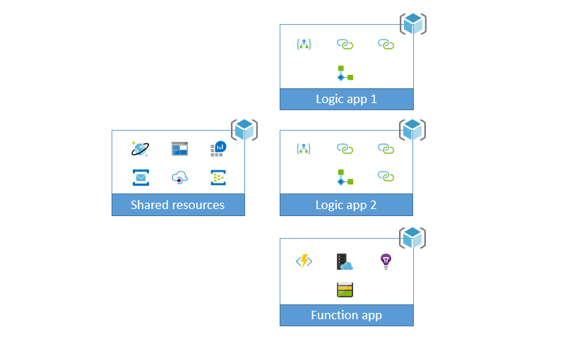
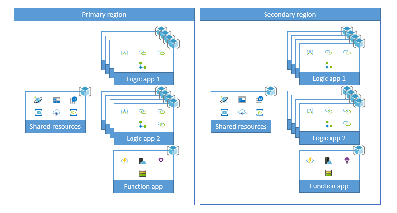

# Concepts

This topic introduces concepts that are followed by the Azure Logic Apps samples that show how to set up a continuous integration (CI) and continuous deployment (CD) pipeline.

## Developer workflow

These samples show how you can streamline both the developer workflow and the release pipeline. A developer's typical workflow looks like this example:

1. The developer makes their changes in their development environment by using Visual Studio Code, Visual Studio, or the Azure portal. They run all the validation steps in that environment and are ready to integrate.

2. The developer downloads the logic app's definition by using Visual Studio Code.

3. The developer reviews the logic app's definition, parameters, and connections to make sure that any environment-specific components are provided dynamically, such as parameters passed into the definition, API connections that might need to be added to the connectors template, resources added to the shared template, or updates to the Azure Resource Manager template that's used to deploy the logic app. For examples, see the samples in this repository.

4. The developer commits the updated templates to source control.

5. The release pipeline automation propagates the changes to all the environments based on the implemented checkpoints.

## Duplicate resources

A typical enterprise scenario usually duplicates resources for these reasons:

* Development teams
  
  Most enterprise development shops have more than one developer on the team. This factor might require that different developers have separate instances. Often, one developer's impact on the resources in the environment can slow down or even halt the development efforts of other team members. When these developers have their own instances, they can work on their areas in a silo, and then integrate that work into the shared environments when other team members are ready to use that work. So, each developer has an environment that looks like this example:

  

* Scaling

  Duplicate resources can make scaling up and down easier, depending on your approach. For more information, see the [Scaling considerations](./scaling.md) topic.

  

* Disaster Recovery (DR)

  DR usually involves setting up a primary region and a secondary region. Some Azure resources have built-in geo-redundant features, but not all do. These resources require duplication across multiple regions and are usually set up to integrate with other resources in those regions. While the production environment is the only environment that actually requires DR capabilities, you must still develop and test the DR resources, which means that these resources require duplication in every environment for DR.

  

* Multiple environments
  
  An enterprise usually needs more than one environment, for example, dev, test, staging, and production.

  

Some might argue the merits for these reasons to duplicate resources, for example:

* Your throughput requirements or API connections don't need the scaling solution.
* You don't have that many environments.
* Your workload is not critical and doesn't require DR.

However, most workloads have at least one of these reasons to duplicate resources. These samples show how you can meet these duplication needs.

## Predictable naming

When you have duplicate resources, you need a consistent way to assign resource names that are unique to their environment but also easily readable by humans. A GUID assigned to each resource name provides uniqueness but not human readability. You need a [naming convention](./naming-convention.md) that meets both needs.

## Separation of concerns

Each sample uses an almost identical [file structure](./file-definitions.md), not only for consistency but also to separate concerns along these boundaries:

* Shared resources

  These resources are often used across the solution space, for example, by different logic apps, function apps, and web apps. Examples include databases, API Management resources, and Log Analytics workspaces.

* Logic app dependencies

  Your logic app depends on specific resources, typically API connections, that aren't shared by other logic apps or areas of the solution. These resources have the same lifespan as your logic app, so they also reside in the same Azure resource group as your logic app.

* Logic app definition

  These samples separate the logic app's definition from the Azure Resource Manager template, which is used in deployment, for these reasons:

  * The logic app's definition, which is the "application code", is the most frequently updated part in the CI/CD pipeline. To streamline the development process by expediting these changes over other changes, these samples pull out just the logic app definition from a development environment by using the [Visual Studio Code extension for Azure Logic Apps](https://marketplace.visualstudio.com/items?itemName=ms-azuretools.vscode-logicapps).

  * The separation between definition and template is at the heart of implementing a CI/CD pipeline for Azure Logic Apps. By separating these pieces, you can focus on building the logic app's workflow, while reducing the effort to deploy these resources across multiple environments.

* Logic app deployment template

  Likewise, these samples separate the Resource Manager template, which is used in deployment, from the logic app's definition for these reasons:

  * The template isn't the same as the logic app's definition.

  * The rate of change in the template is much slower than in the logic app definition.
